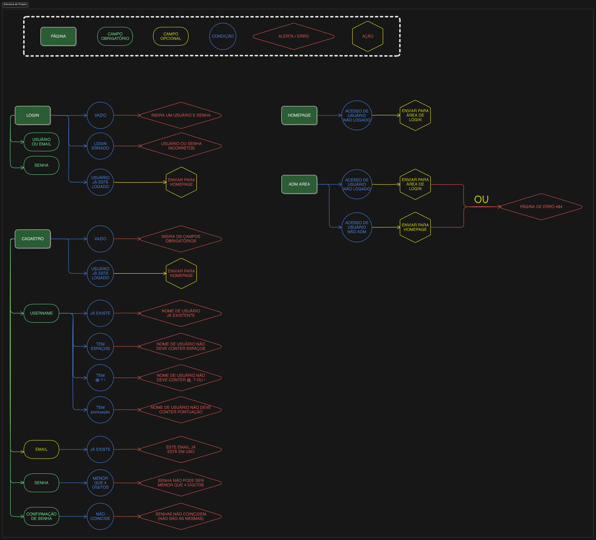

# PWEB - Atividade 11 | Blaze Rod

Criação de uma aplicação web simples com login e senha através do framework express.

## Estrutura do Projeto

## Páginas Checklist (Será apagado após a conclusão do projeto)

Obs: onde estiver flags como (ideia minha), são coisas que foram minhas ideias e não eram exatamente requisitos do projeto.

### Página Inicial (ideia minha)

- [x] Link para login
- [x] Link para cadastro

### Login

- [x] Mensagem de erro
- [x] Usuário ou Email (usuário foi ideia minha)
- [x] Senha
- [x] Enviar para a Homepage após o login ser um sucesso

### Sign up

- [x] Mensagem de erro
- [x] Nome de Usuário (ideia minha)
- [x] Email
- [x] Senha
- [x] Confirmação de Senha
- [x] Enviar para a Login após o cadastro ser um sucesso

### Página de Perfil do Usuário

- Ainda a ser pensado

### Página de Administrador (Ideia Minha)

- [ ] Só pode ser acessado por adms (ideia minha)
- [ ] Lista com todos os usuários e seus emails
- [ ] Botão para excluir usuários

## Dependências e Frameworks

|                         Site da Dependência ou Framework | Motivo da utilização                       |
| -------------------------------------------------------: | :----------------------------------------- |
|                   [Bootstrap](https://getbootstrap.com/) | Framework de Estilização                   |
| [Validator](https://github.com/validatorjs/validator.js) | Fazer validações de forma simples          |
|                                   [EJS](https://ejs.co/) | HTML dinâmico usando JS                    |
|                  [Express](https://expressjs.com/pt-br/) | Framework para desenvolvimento web         |
|  [Express Session](https://github.com/expressjs/session) | Middleware do express para guardar sessões |

    npm i validator ejs express express-session

## Vídeos

### [SISTEMA DE LOGIN COM NODE JS | TUTORIAL DE JAVASCRIPT](https://www.youtube.com/watch?v=rXWa9jtHu7g)

- Me apresentou o express-session

### [Make a register/login page in node js using MYSQL](https://www.youtube.com/watch?v=zofORFv0K5g)

- Me deu a ideia de como organizar o projeto
- Tutorial para conectar a um banco de dados, pode vir a ser útil no futuro.

## Referências

[EJS Tutorial](https://www.digitalocean.com/community/tutorials/how-to-use-ejs-to-template-your-node-application-pt) - Tutorial para a utilização do EJS

[Express Tutorial](https://dev.to/gabrielhsilvestre/o-basico-express-rotas-4i70) - Tutorial de rotas no express
